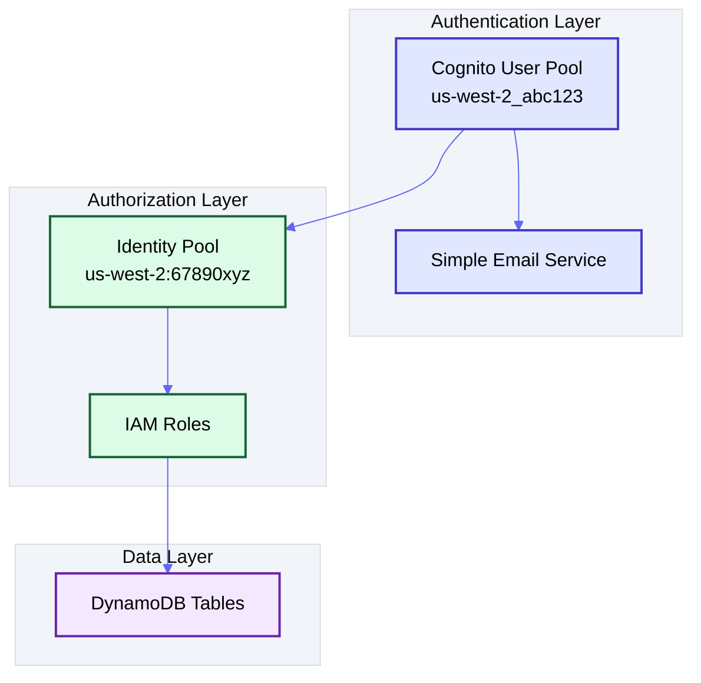
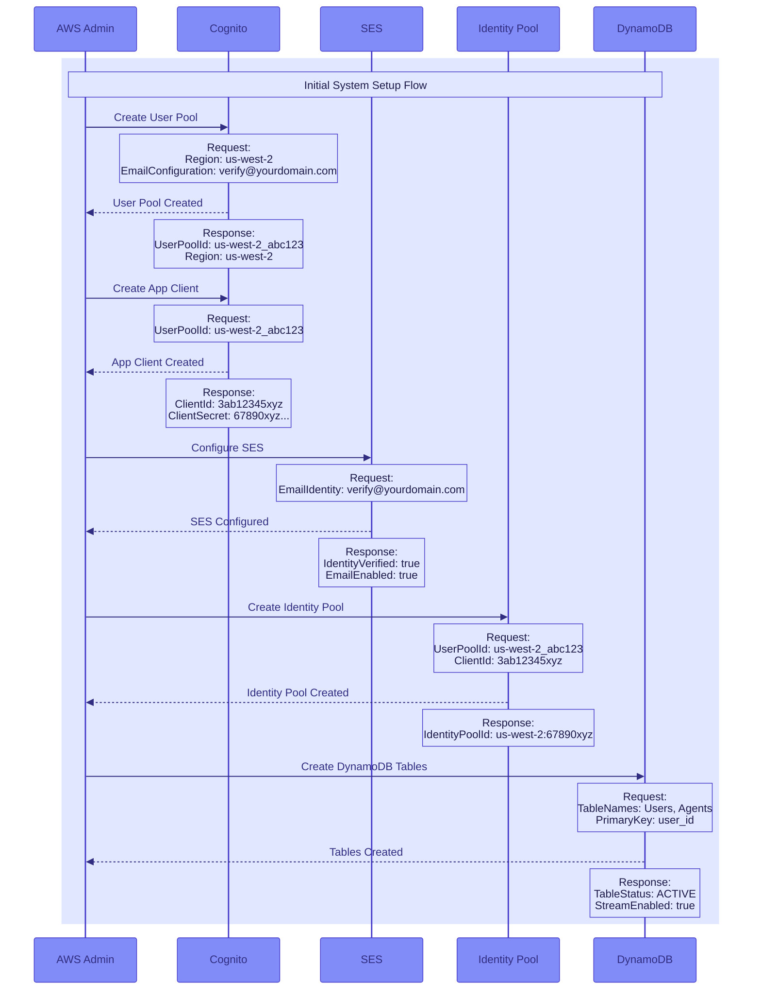
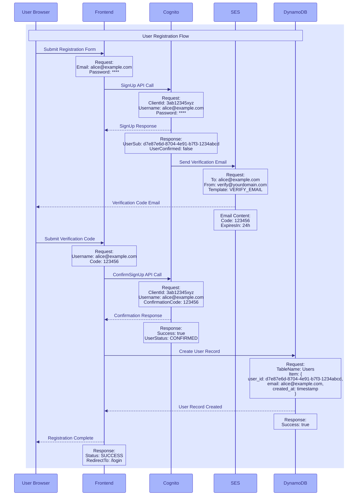
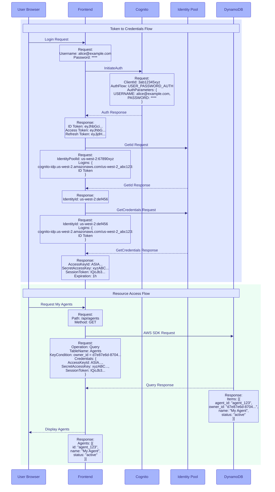

# Authentication and Authorization Design

## Overview

### Cognito User Pools
User Pools serve as our user directory and authentication system. They:
- Handle user registration and authentication
- Manage user attributes and verification
- Issue JWT tokens for identity verification
- Integrate with SES for email verification

### Cognito Identity Pools
Identity Pools provide secure AWS service access. They:
- Issue temporary AWS credentials
- Map authenticated users to IAM roles
- Enable fine-grained access control
- Integrate with User Pools for authentication

### System Architecture



## Authentication Flows

### System Setup Flow



### User Registration Flow



### User Authentication Flow



## Token and Credential Management

### JWT Tokens
1. **ID Token**: Contains user identity
   ```json
   {
       "sub": "d7e87e6d-8704-4e91-b7f3-1234abcd",
       "email": "alice@example.com",
       "token_use": "id",
       "iss": "https://cognito-idp.us-west-2.amazonaws.com/us-west-2_abc123",
       "exp": 1704980400,
       "iat": 1704976800,
       "auth_time": 1704976800
   }
   ```

2. **Access Token**: Contains permissions
   ```json
   {
       "sub": "d7e87e6d-8704-4e91-b7f3-1234abcd",
       "device_key": "us-west-2_device_123xyz",
       "token_use": "access",
       "scope": "aws.cognito.signin.user.admin",
       "iss": "https://cognito-idp.us-west-2.amazonaws.com/us-west-2_abc123",
       "exp": 1704980400,
       "iat": 1704976800,
       "jti": "87e6d-8704-4e91-b7f3",
       "client_id": "client123xyz"
   }
   ```

3. **Refresh Token**: Used to obtain new access tokens
   ```json
   {
       "sub": "d7e87e6d-8704-4e91-b7f3-1234abcd",
       "device_key": "us-west-2_device_123xyz",
       "token_use": "refresh",
       "iss": "https://cognito-idp.us-west-2.amazonaws.com/us-west-2_abc123",
       "exp": 1705581600,
       "iat": 1704976800
   }
   ```

### AWS Credentials
```json
{
    "AccessKeyId": "ASIA...",
    "SecretAccessKey": "xyzABC...",
    "SessionToken": "IQoJb3...",
    "Expiration": 3600
}
```

### Cognito ClientId Considerations

#### When ClientId is Required

The Cognito App Client ID is only required for identity operations with Cognito:
- User registration (SignUp, ConfirmSignUp)
- User authentication (InitiateAuth)
- Password reset flows
- Token refresh operations

After successful authentication, subsequent operations use JWT tokens and temporary AWS credentials instead of ClientId.

#### Security Note

The ClientId is a public identifier (like an OAuth client ID) and not a secret:
- Can be safely exposed in frontend code
- Security is handled through other mechanisms (tokens, credentials, CORS, etc.)

#### Vercel Configuration

Configure ClientId in Vercel using environment variables:
1. In Vercel dashboard: Settings → Environment Variables
2. Add CLIENT_ID (e.g `USER_POOL_CLIENT_ID`) with your Cognito App Client ID
3. Deploy your application

## Access Control Implementation

#### Overview
The platform implements row-level security using Amazon Cognito and DynamoDB to ensure users can only access their own resources.

#### DynamoDB Access Control

1. **User Data Access**
   ```javascript
   {
       "Effect": "Allow",
       "Action": [
           "dynamodb:GetItem",
           "dynamodb:PutItem",
           "dynamodb:Query"
       ],
       "Resource": "arn:aws:dynamodb:${region}:${account}:table/Users",
       "Condition": {
           "ForAllValues:StringEquals": {
               "dynamodb:LeadingKeys": ["${aws:PrincipalTag/user_id}"]
           }
       }
   }
   ```
   - Users can only access their own profile using their Cognito user ID
   - The user_id is mapped from Cognito user attributes to PrincipalTag
   - Row-level security enforced through IAM policy conditions

2. **Agent Data Protection**
   ```javascript
   {
       "Effect": "Allow",
       "Action": [
           "dynamodb:GetItem",
           "dynamodb:PutItem",
           "dynamodb:Query",
           "dynamodb:UpdateItem",
           "dynamodb:DeleteItem"
       ],
       "Resource": "arn:aws:dynamodb:${region}:${account}:table/Agents",
       "Condition": {
           "ForAllValues:StringEquals": {
               "dynamodb:LeadingKeys": ["${aws:PrincipalTag/user_id}"]
           }
       }
   }
   ```
   - Agent records include owner_id matching Cognito user ID
   - Users can only access agents where they are the owner
   - All agent operations (create, read, update, delete) are protected

### Protection Mechanisms

1. **Identity Verification**
   - Every request requires a valid JWT token
   - Tokens contain the user's unique identifier
   - Tokens expire automatically after a set period
   - Invalid or expired tokens are immediately rejected

2. **Resource Ownership**
   - All resources (users, agents) have an owner field
   - Database queries automatically filter by owner
   - Ownership is verified before any modification
   - Unauthorized access attempts are logged
