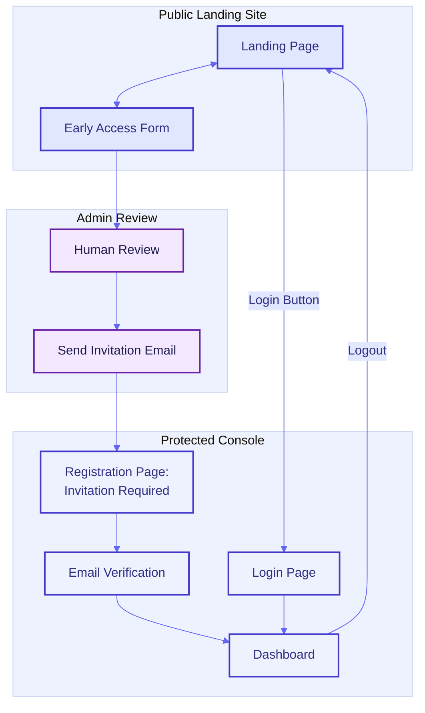
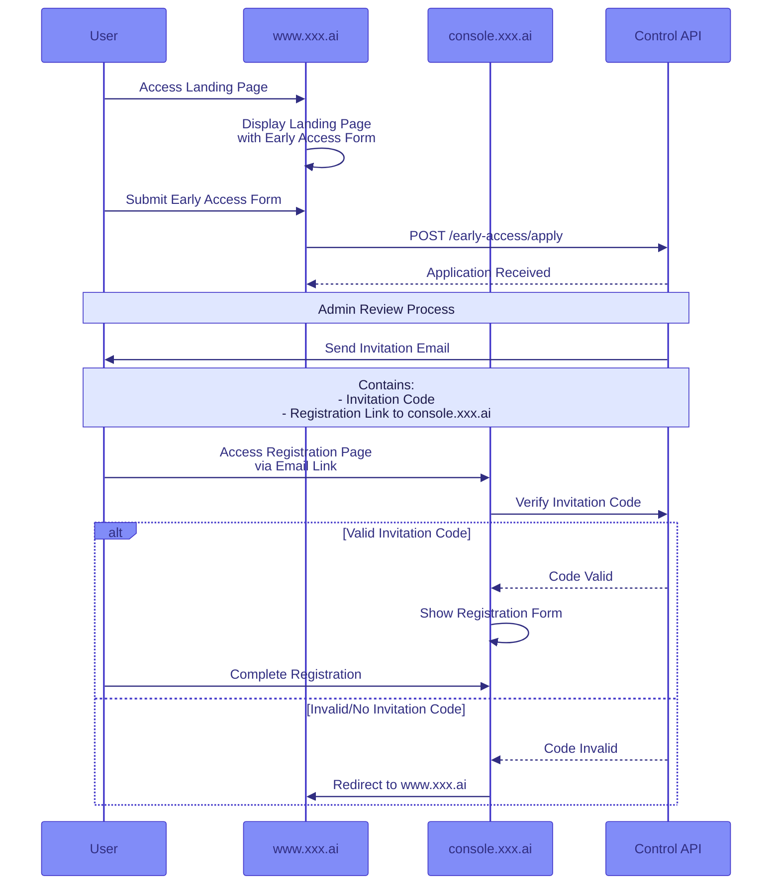
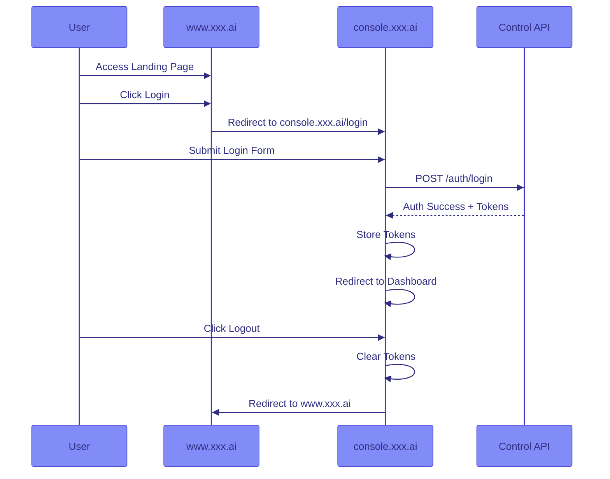

# Web Service Frontend Design Document

## Overview

A Next.js-based frontend application for the Agent Network Platform with two separate domains:
- `www.xxx.ai`: Public landing page and early access
- `console.xxx.ai`: Protected console application

## Architecture

### Domain Structure
```plaintext
www.xxx.ai/                    # Public Landing Site
├── page.tsx                   # Landing page with early access form
└── (auth)/                    # Auth route group
    └── login/                 # Login page
        └── page.tsx

console.xxx.ai/                # Protected Console
├── page.tsx                   # Dashboard
├── (auth)/                    # Auth route group
│   ├── register/             # Invitation-only registration
│   │   └── page.tsx    
│   ├── verify/              # Email verification
│   │   └── page.tsx
│   └── reset/              # Password reset
│       └── page.tsx
└── dashboard/              # Protected routes
```

## Navigation Flow

### Domain-based User Journey


### Registration Access Control Flow


### Authentication Flow


## Frontend-Backend Interface

### Domain-specific Endpoints

#### www.xxx.ai Endpoints

| Endpoint | Method | Purpose | Request Data | Response |
|----------|--------|----------|--------------|-----------|
| `/early-access/apply` | POST | Submit early access application | name, company, position, email, use_case | application_id |

#### console.xxx.ai Endpoints

| Endpoint | Method | Purpose | Request Data | Response |
|----------|--------|----------|--------------|-----------|
| `/auth/register` | POST | Register with invitation | email, password, invitation_code | user_id, requiresConfirmation |
| `/auth/verify` | POST | Verify email | email, code | success status |
| `/auth/login` | POST | Authenticate user | email, password | tokens, user data |
| `/auth/reset` | POST | Reset password | email, code, new_password | success status |

## Security Implementation

### Registration Security
1. **Invitation Code Protection**
   - Registration page only accessible via email link
   - Server-side invitation code validation
   - One-time use invitation codes
   - Code expiration handling
   - Rate limiting on code verification

2. **Domain Security**
   - Cross-Origin Resource Sharing (CORS) configuration
   - Protected routes on console.xxx.ai
   - Secure session management
   - HTTP-only cookies for tokens

### Environment Configuration

```env
# www.xxx.ai (.env)
NEXT_PUBLIC_CONSOLE_URL=https://console.xxx.ai
NEXT_PUBLIC_CONTROL_API_URL=https://api.xxx.ai

# console.xxx.ai (.env)
NEXT_PUBLIC_WWW_URL=https://www.xxx.ai
NEXT_PUBLIC_CONTROL_API_URL=https://api.xxx.ai
NEXT_PUBLIC_AUTH_DOMAIN=xxx.ai
NEXT_PUBLIC_USER_POOL_ID=us-west-2_abc123
NEXT_PUBLIC_USER_POOL_CLIENT_ID=client123xyz
```

## Middleware Implementation

### Registration Access Control
```typescript
// console.xxx.ai/middleware.ts
export async function middleware(request: NextRequest) {
  // Only apply to registration page
  if (request.nextUrl.pathname.startsWith('/auth/register')) {
    const invitationCode = request.nextUrl.searchParams.get('code')
    
    if (!invitationCode) {
      return NextResponse.redirect('https://www.xxx.ai')
    }
    
    // Verify invitation code with API
    const isValid = await verifyInvitationCode(invitationCode)
    if (!isValid) {
      return NextResponse.redirect('https://www.xxx.ai')
    }
  }
}

export const config = {
  matcher: '/auth/register'
}
```
